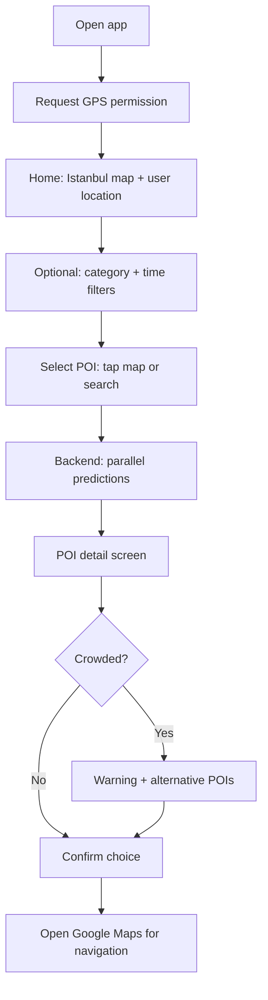

# Istanbul Crowd Compass — Final Website UX Flow

This document describes the **target end-to-end user experience** for the web app, as agreed with product direction. It is the single reference for **what the user does**, **what the system returns**, and **how screens connect**. Technical implementation details live in [`WEBSITE_DOCUMENTATION.md`](./WEBSITE_DOCUMENTATION.md).

---

## Purpose

Help visitors choose **when and where** to go in Istanbul by showing **crowd level at a place**, **congestion around it**, and **less crowded alternatives**, then send them to **Google Maps** for navigation.

---

## MVP data honesty (current prototype)

Until per-venue or road-traffic feeds are integrated, the backend serves a **single city-wide weekly crowd index** derived from the notebook pipeline (`model_dataset_with_holidays.csv` bundled as `istanbul_weekly_model.csv`). **Every map selection receives the same score and level** for that data week; the UI states this explicitly. **“Alternatives nearby”** are ranked by the pandas recommendation pipeline (**`POST /api/recommendations`**) from the POI catalog using distance, preferences, and modeled crowd features—they are **not** measured “quieter queues” at those POIs. Area traffic copy is labeled as **not** a live road API. This matches **Option A — honest MVP** from product/engineering review.

---

## Preconditions

- The app is optimized for **Istanbul** (map viewport and POI data).
- The user has a modern browser with **location services** available (exact behavior depends on browser/OS permission prompts).

---

## Flow overview

---

## Step-by-step flow

### 1. Entry and location permission

1. The user opens the app.
2. The app **asks for GPS / location permission** (browser geolocation).  
   - If denied, the map still works; the user’s position is not shown until they allow location or select a place manually.

**UX goal:** Establish “where am I?” as the default context before browsing POIs.

---

### 2. Home screen — map of Istanbul

1. The **home screen** shows a **map centered on Istanbul**.
2. The **user’s current location** is **marked on the map** (when permission is granted).
3. POIs (or category clusters) may appear according to filters (next step).

**UX goal:** Immediate spatial orientation — user sees the city and themselves on it.

---

### 3. Filters — category and optional time

1. The user can **filter by category** of the place they want to visit (for example: historic site, park, museum, viewpoint — exact categories follow data/model design).
2. **Time selection** (optional / TBD in UI):  
   - **If included:** user picks a **date**, **time of day**, or **“now”** so forecasts match “when I plan to go.”  
   - **If omitted:** defaults apply (e.g. current time or a sensible default window) and copy should say what is assumed.

**UX goal:** Narrow the map and predictions to the user’s intent without forcing extra taps when they only want to browse.

---

### 4. Choosing a place — map tap or search

1. The user **taps a POI on the map**, **or**  
2. **Searches by name** and selects a result.

**UX goal:** Two familiar paths to the same **POI detail** experience.

---

### 5. Backend — run models in parallel

When a POI is selected (and optional time context is known), the **backend runs the models together** (conceptually in parallel) and returns a consolidated response:

| Output | Question it answers |
|--------|----------------------|
| **a. POI crowd** | How busy is **this POI** itself? |
| **b. Area traffic** | How congested is the **area around** it? |
| **c. Alternatives** | What are **similar but less crowded** POIs nearby? |

**UX goal:** One loading state; one payload that powers the detail screen and the “alternatives” module.

---

### 6. POI detail screen

The **POI detail** view shows at least:

| Element | Description |
|---------|-------------|
| **a. POI crowd level** | **Low / Medium / High** (or equivalent labels), tied to the selected POI and time context. |
| **b. Area traffic level** | **Low / Medium / High** for congestion around the POI (not the same as POI-only busyness). |
| **c. Best time to visit** | Suggested **quieter window(s)** — useful for **future planning** and as a product differentiator. |
| **d. Travel options** *(optional / TBD)* | **Walk, transit, drive** with **estimated travel time** from the user’s current location (or last known). If scope is tight, this can ship later; the flow still works with static “open in Maps” only. |

**UX goal:** Answer “should I go here?” and “when is better?” in one screen.

---

### 7. Crowding warning and alternatives

1. If the selected POI is **crowded** (per model thresholds), the app shows a **clear warning**.
2. It lists **other POIs nearby** that are **similar** but **less crowded**, loaded via **`POST /api/recommendations`** (alongside crowd context from **`POST /api/forecast`**).

**UX goal:** Turn a dead-end (“too busy”) into a decision (“here are better options now”).

---

### 8. Decision and navigation

1. The user **chooses** either the **original POI** or one of the **alternatives**.
2. The app provides a **link to Google Maps** (or opens the Maps app on mobile) for **turn-by-turn navigation** to the chosen place.

**UX goal:** Close the loop from discovery → forecast → **real-world navigation**.

---

## Open design choices (to lock in UI copy and API)

- **Time filter:** required vs optional default; label for “unspecified time.”
- **Travel times:** in-app estimates vs “directions only” in Google Maps.
- **Thresholds:** what numeric score counts as “crowded” for the warning state.

---

## Relation to the current prototype

The existing frontend ([`WEBSITE_DOCUMENTATION.md`](./WEBSITE_DOCUMENTATION.md)) already has map selection, search, and geolocation patterns. This document defines the **target UX** to converge those patterns with **multi-signal predictions**, **alternatives**, and **Maps handoff**.

The **flow overview** diagram above is reflected in the prototype UI: **Share location** (GPS), **Istanbul map** with marker sync, **category + horizon filters**, **map tap / search** selection, **`POST /api/forecast`** for crowd signals, **`POST /api/recommendations`** for ranked nearby alternatives, **POI-style detail** (place crowd, area traffic, best time, trend), a **crowded** branch with **nearby alternatives** from the recommendation pipeline, and **Open in Google Maps** for navigation.
